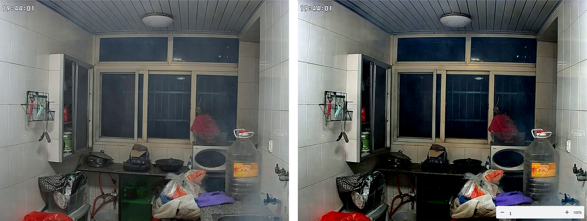
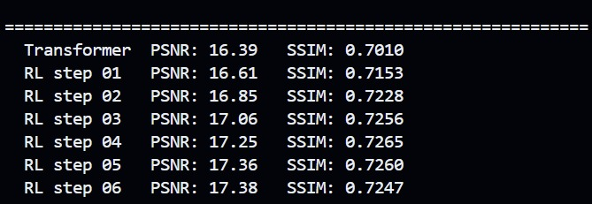

# IMage of restoration via Reinforcement Learning (IMRL)

This repository contains code for the paper "IMage of restoration via Reinforcement Learning (IMRL)", which proposes a novel approach to image restoration using reinforcement learning. The code is implemented in Python and utilizes PyTorch for deep learning.

# image showing diff between transformer and rl

# Metrics
